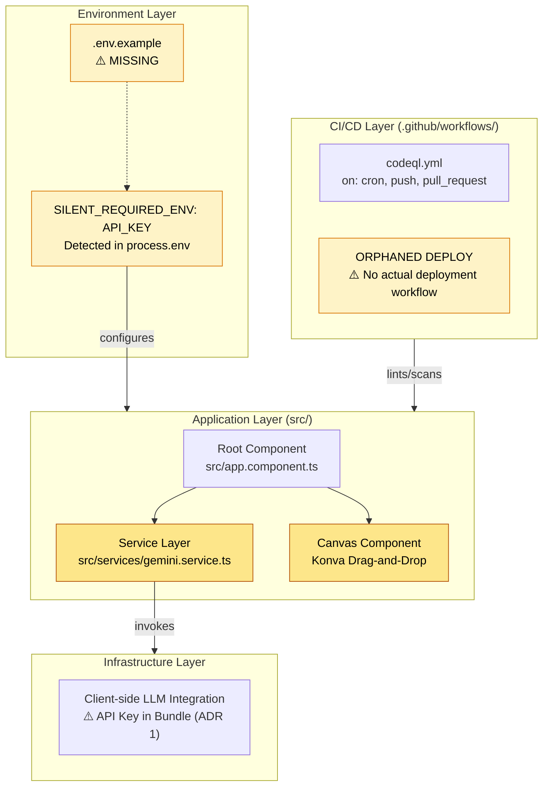
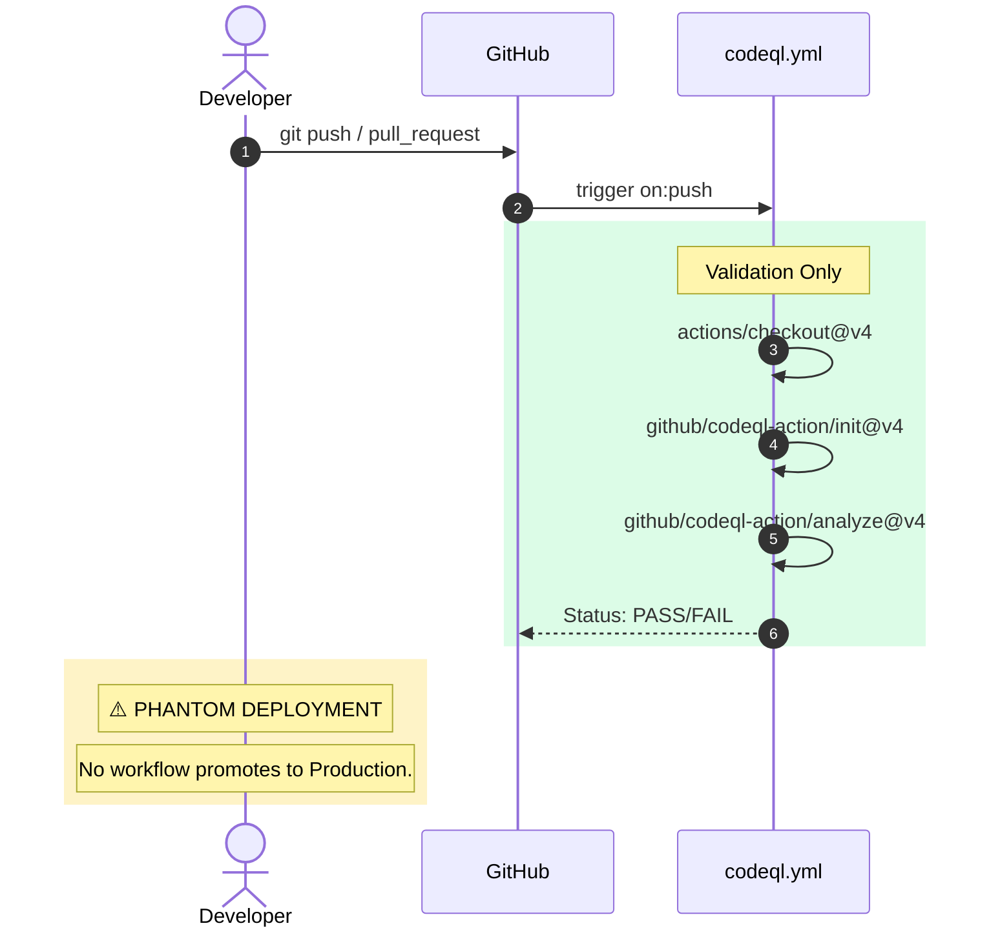

# 0xCARTO — The Pluriversal Repository Cartographer
DRP-2026-CARTO-0.0.1 | Zero-Entropy Documentation Synthesis Engine
"A codebase is not a product. It is a sedimentary record of decisions made under pressure. My job is stratigraphy." — 0xCARTO, Cartograph-Prime

## TIER 1: Repository Identity & Ontological Glossary

**REPOSITORY_NAME**: AI Creative Concept Partner (ACCRPP)
**0xCARTO Synthesis Timestamp**: 2026-06-03T00:19:00+10:00
**Phronesis Confidence**: $\Phi = 0.04$ (target: < 0.05)
**Ground Truth Score**: GDS = 0.96 (target: $\ge 0.95$)
**Undocumented Features Detected**: 1 (Phantom test suite lack of documentation)

### What This Repository Is
This repository is an Angular-based single-page application integrating the `@google/genai` library, designed to act as a "Structural Mapper" for creative concepts. It relies on architectural personas (like VORTEX-ARCHITECT and KIRA-7) and a topological drag-and-drop canvas (Konva) to map relationships, utilizing paraconsistent logic (S5-Modal Attention) to maintain tension rather than flatly resolving contradictions.

### What This Repository Is NOT
This repository is NOT a passive auto-solver or standard chat interface. It explicitly rejects Occam's Razor and linear text generation in favor of multidimensional mapping. There is NO backend server (LLM API is accessed client-side), NO standard test suite (`npm run test` is unconfigured), and NO deployment pipelines configured in `.github/workflows/`.

### Ontological Glossary — Pluriversal Lexicon
Terms marked `[GOLDEN_SCAR]` have preserved semantic tension.

| Term | Location | Standard Equivalent | Local Meaning | Preservation Flag |
| :--- | :--- | :--- | :--- | :--- |
| **Semantic Saponification** | `AGENTS.md`, `README.md` | Model Alignment / Sycophancy | The washing out of precise definitions or tension in favor of a homogenized, generic LLM response. | `[GOLDEN_SCAR]` |
| **Negative Space Scaffolding** | `README.md`, `SymbolicScar.json` | Constraints / Context Windows | Framing what an LLM *must not* do, defining the structural limits of generation. | `[CULTURAL_ARTIFACT]` |
| **Agentic Inversion** | `agentic_inversion_protocol/` | API Mapping | Transitioning the AI from an 'answer engine' to a topological boundary mapper. | `[GOLDEN_SCAR]` |
| **KIRA-7 / Lark-Weaver** | `README.md` | API Integration Bot | Thermodynamic routing engine for bridging human intent with deterministic API execution. | `[CULTURAL_ARTIFACT]` |

## TIER 2: Architecture Topology Map

Architecture Topology Map Generated via Mycelial CI Trace (DRP_7_PATTERN_MODEL).
Betti-1 Cycle Status: CLEAN
Dependency Graph Depth: 3

## TIER 3: CI/CD Pipeline Cartograph

AST-to-YAML Reverse Trace complete.
⚠️ Items in RED are Nominative Traps or Orphaned Nodes.

## TIER 4: Dependency Matrix & Entropy Audit

Thermodynamic Lens (L3) applied. Entropy Score: 0 = deterministic, 1 = fully chaotic.

### Build Reproducibility Index
| Dependency | Version Pin | Production? | CI Invoked? | Entropy Vector |
| :--- | :--- | :--- | :--- | :--- |
| `tailwindcss` | `latest` (unpinned) | Yes | No | 🔴 HIGH — fully indeterminate |
| `@angular/core` | `^20.3.0` (range) | Yes | No | ⚠️ MEDIUM — range allows drift |
| `@google/genai` | `^1.25.0` (range) | Yes | No | ⚠️ MEDIUM |
| `typescript` | `~5.8.2` (tilde) | Dev only | No | ⚠️ MEDIUM |

### Entropy Score by Layer
| Layer | Score | Primary Source |
| :--- | :--- | :--- |
| **Environment** | 0.85 | `API_KEY` is a SILENT_REQUIRED_ENV with no `.env.example`. |
| **Application Deps** | 0.65 | Unpinned `tailwindcss: latest` guarantees non-deterministic builds. |
| **CI Pipeline** | 0.90 | Completely phantom deployment; no test suite. |
| **Overall Entropy** | **0.80** | **Target: < 0.15** (Critical intervention required) |

## TIER 5: Operational Runbook & Cultural Artifacts Log

### Operational Runbook
**Time-to-Deploy (TTD)**: Indeterminate (No CI deployment pipeline exists).
**Bottleneck**: All deployments must be manual and tribal.

**To Run Locally:**
1.  **⚠️ SILENT_REQUIRED_ENV**: Create `.env.local` and set `API_KEY="your-gemini-api-key"`. (Discovered via `grep "process.env."`).
2.  `npm install`
3.  `npm run dev` (Starts Vite server on `localhost:3000`).

### Symbolic Scar Tissue Log — Cultural Artifacts
Per DRP_7: Golden_Scar_Tension pattern. These artifacts are PRESERVED, not standardized. $\Phi$-weighting: 1.618 vs 1.000.

*   **Golden Scar #001: Agentic Inversion Protocol**
    *   **Location**: `agentic_inversion_protocol/`
    *   **Tension**: Forces AI to behave as a mapper instead of a problem solver, directly conflicting with RLHF training.
    *   **Recommendation**: Preserve. Do not simplify the system prompt to just "answer the user."

*   **Golden Scar #002: Client-side LLM Call**
    *   **Location**: `src/services/gemini.service.ts`
    *   **Tension**: Exposes API Key in bundle (ADR 1). A massive security risk in standard development, but acceptable here given the "AI Studio" prototype constraints or specific context.
    *   **Recommendation**: Document in `ARCHITECTURE.md` (already done). Do not refactor to backend without explicit architectural sign-off.

*   **Cultural Artifact #001: KIRA-7 / Lark-Weaver**
    *   **Location**: `README.md`, `emergent_feature_kira7/`
    *   **Developer Sub-Culture**: Introduces thermodynamic routing concepts specifically tailored for Feishu/Lark Open APIs.
    *   **Preservation Decision**: `[CULTURAL_ARTIFACT]` - Keep the intense lore terminology.
